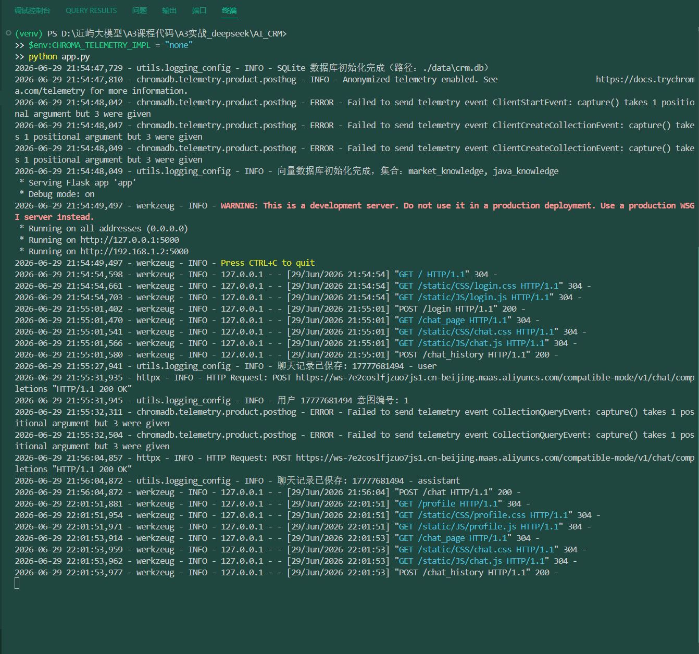
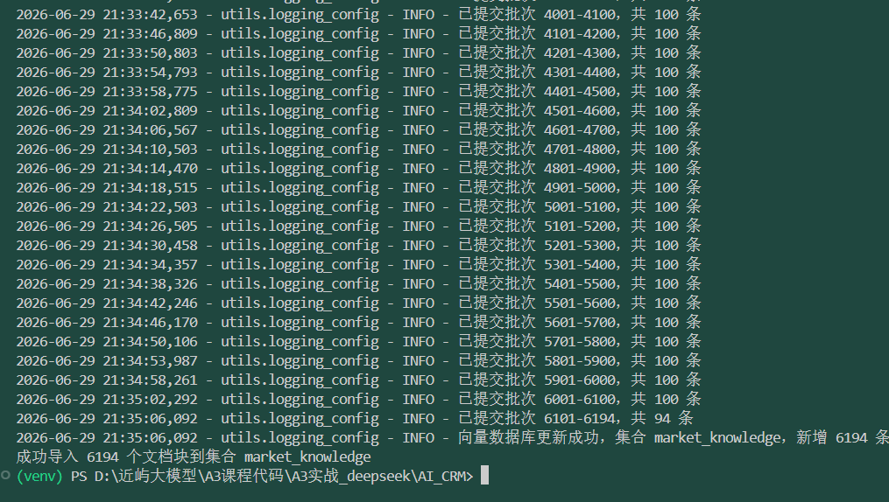
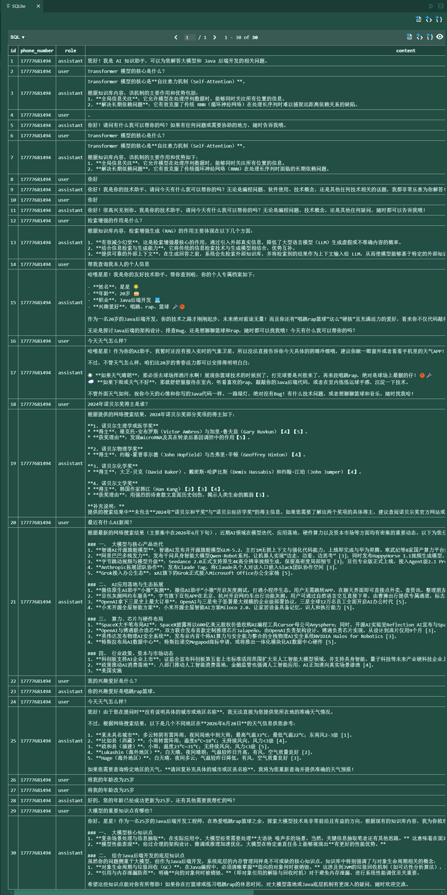
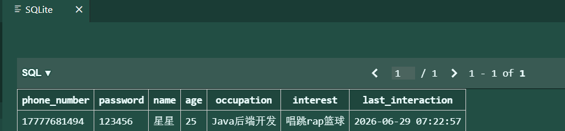
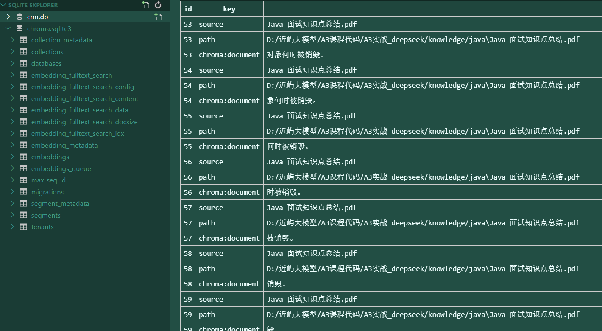

# 项目代码的阐述

### 1.*完整代码+运行截图/录屏*

#### 1.1**完整代码见项目代码文件夹**

#### 1.2**运行截图**

**项目启动示意图：**



**文件导入知识库示意图**



**聊天内容示意图：**


**数据库历史聊天记录示意图：**



**数据库个人信息示意图：**


**知识库内容示意图**：



### 2.*阐述function calling工具定义的基本信息，如function calling工具搭建的基本流程，定义的函数功能*

#### 2.1工具定义方式

在项目中，*Function Calling* 工具的定义主要采用两种方式：

**方式一：使用 *LangChain* 的 `@tool` 装饰器（早期原型 `tools.py`，已归档到 `../_archive_main_flow/`，生产代码走方式二）**

```python
from langchain.tools import tool

@tool
def get_user_info(phone_number: str) -> str:
    """根据手机号查询用户基本信息。"""
    info = get_user_info_from_db(phone_number)
    if info:
        return f"姓名: {info['name']}, 年龄: {info['age']}, 职业: {info['occupation']}, 兴趣: {info['interest']}"
    return f"未找到手机号 {phone_number} 的用户信息"
```

`@tool` 装饰器会自动将函数转换为 *LangChain* 的 `StructuredTool` 对象，并提取 *docstring* 作为工具描述，参数类型从函数签名推断。

**方式二：使用 `StructuredTool.from_function` 工厂方法（`function_calling_handler.py`）**

```python
from langchain.tools import StructuredTool

def _get_user_info() -> str:
    info = get_user_info_from_db(phone_number)
    if info:
        return f"姓名: {info['name']}, 年龄: {info['age']}, 职业: {info['occupation']}, 兴趣: {info['interest']}"
    return f"未找到手机号 {phone_number} 的用户信息"

get_tool = StructuredTool.from_function(
    func=_get_user_info,
    name="get_user_info",
    description="查询当前登录用户的个人信息，不需要任何参数。"
)
```

#### 2.2工具定义的基本流程

**定义功能函数**：编写完成特定业务逻辑的 Python 函数（如查询用户信息、更新用户信息）。

**包装为 LangChain 工具**：使用 `@tool` 装饰器或 `StructuredTool.from_function` 将函数包装成工具对象，并明确其名称、描述和参数说明。

**绑定到大模型**：在调用大模型时，通过 `bind_tools()` 方法将工具列表传递给模型，使模型具备调用这些工具的能力。

**处理工具调用响应**：模型返回 `tool_calls` 后，解析工具名称和参数，执行对应的函数，并将执行结果以 `tool` 角色消息返回给模型，最终生成自然语言回答。

#### 1.3 项目中定义的函数功能

| **工具名称**     | 功能描述                                             | 输入参数                                                     | 输出                   |
| :--------------- | :--------------------------------------------------- | ------------------------------------------------------------ | ---------------------- |
| get_user_info    | 查询当前登录用户的个人信息（姓名、年龄、职业、兴趣） | 无（通过闭包绑定 `phone_number`）                            | 格式化的个人信息字符串 |
| update_user_info | 更新当前登录用户的个人信息                           | `name`（可选）、`age`（可选）、`occupation`（可选）、`interest`（可选） | 更新成功或失败的提示   |

​	这些工具在 `function_calling_handler.py` 中被实际使用，当意图识别为 `4` 时，系统会调用该处理函数，让模型自主决定是否调用工具以及如何调用。

### 3.*RAG存储的内容描述，调研RAG有哪些优化方式，并阐述怎么跟本项目进行融合*

#### 3.1 RAG 存储内容描述

​	项目中的 RAG 知识库使用 **Chroma 向量数据库** 进行本地持久化，路径由 `config.CHROMA_PERSIST_DIR` 指定，当前为 `./data/chroma_db_v2`（`_v2` 是修复文本分块缺陷之后重建的库，旧库已删除）。集合空间度量为余弦（建集合时写入 `metadata={"hnsw:space": "cosine"}`）。包含两个集合：

| 集合常量 | 集合名 | 存储内容                                                     | 数据来源                                                     |
| -------- | --------------- | ------------------------------------------------------------ | ------------------------------------------------------------ |
| COLLECTION_MARKET | market_knowledge | 大模型知识点（Transformer、LLM、RAG、分布式训练、微调/RAG 面等） | 51 篇课程 PDF，经 `import_knowledge.py` 批量导入（当前 656 块） |
| COLLECTION_COURSE | java_knowledge   | Java 后端八股文（JVM、并发、Spring、MySQL、Redis、设计模式等） | `Java 面试知识点总结.pdf`（当前 16 块）                        |

​	每个文档在存入时会被切割成 **文本块（chunk）**，参数为 `chunk_size=500` 字符、`overlap=50` 字符，另有 `min_chunk=30` 的短块门槛（页眉、"扫码加查看更多"这类无信息行直接丢弃，否则短句会以高相似的身份抢走正文的召回位）。切分逻辑在 `file_loader.chunk_text`：逐行清洗后按**固定步长** `stride = chunk_size - overlap` 聚合落块，遇到超长单行（PDF 整段不换行）先落缓冲块、再对该行做定长滑窗。

当前库的实测规模与块长度分布：

| 集合 | 块数 | 嵌入维度 | 块长 中位数 | 块长 最短/最长 | ≥400 字符占比 |
| --- | --- | --- | --- | --- | --- |
| market_knowledge | 656 | 768 | 517 | 55 / 586 | 94.7%（621/656） |
| java_knowledge | 16 | 768 | 512 | 215 / 540 | 93.8%（15/16） |

每个块存储：

- **文本内容**（用于向量化和检索）
- **嵌入向量**（由本地 `BAAI/bge-base-zh-v1.5` 生成，768 维，中文语义优于 Chroma 默认的英文 `all-MiniLM-L6-v2`。踩过的坑：`client.get_collection()` 不会可靠恢复持久化时的 embedding function，会静默退回默认 384 维模型，导致查询时抛 `InvalidDimensionException`——所以读写两侧都必须显式传入同一个 embedding 函数，`db/vector_db.py` 已按模块级单例处理）
- **元数据**（`source` 来源文件名；`import_knowledge.py` 另存 `path`，`/upload_knowledge` 另存 `collection`，用于回答末尾的引用溯源）

检索时，用户问题先经 `kb_router.retrieval_plan` 做主题路由，再在选中的集合里按余弦相似度取最相似的块：**判为单域时该域独占 4 个槽位（`TOP_K_SINGLE=4`），判为双域或难以区分时两域各取 2 条（`TOP_K_SHARED=2`），总槽位恒为 4**，既去掉跨域噪声又不撑大 prompt。取回的块去重后拼接成上下文，与用户问题一起提交给大模型生成回答。

#### 3.2 RAG 优化方式调研及融合方案

| 优化方式                        | 描述                                                         | 本项目融合方案                                               |
| ------------------------------- | ------------------------------------------------------------ | ------------------------------------------------------------ |
| **分块策略优化**                | 调整 `chunk_size` 和 `overlap`，使块更贴合语义单元           | **已落地（本轮收益最大的一项）**：除 `500/50` 参数外，修复了 `chunk_text` 的**步长塌缩**缺陷——原实现 `start = max(end - overlap, start + 1)` 在断句点紧贴块起点时步长退化为 1，同一句话被"每次少一个字符"地重复切出大量 1~40 字的近重复块（旧库 6197 块中约 4110 块、即 66% 属此类）。现改为固定步长 `stride = chunk_size - overlap`，与标点位置彻底解耦，并用 `min_chunk=30` 门槛清掉无信息短句。重建后的块长分布见 3.1。 |
| **混合检索（Hybrid Search）**   | 结合向量检索（语义）和关键词检索（BM25/TF-IDF），提高召回率  | Chroma 原生支持 `where` 过滤，但混合检索需要额外集成。可在 `query_collection` 中先进行向量检索，再用关键词过滤或结合 `rank_bm25` 对结果重排序。 |
| **重排序（Re-ranking）**        | 使用专用模型（如 `cross-encoder`）对初筛结果重新打分，提高精准度 | 在 `get_response_from_vectorstore` 中，先检索 Top-10，再用轻量级重排序模型（如 `ms-marco-MiniLM-L-6-v2`）筛选 Top-3，提升最终上下文质量。 |
| **查询重写（Query Rewriting）** | 用大模型将用户问题改写为多个不同表述，分别检索后合并结果     | 在 `handle_other_intents` 或 RAG 分支中，可调用 LLM 生成 2-3 个同义问题，并行检索后融合结果，提升鲁棒性。 |
| **元数据过滤**                  | 根据用户信息（如兴趣）或文档标签提前过滤集合                 | 在 `query_collection` 中增加 `where` 参数，例如只检索与用户兴趣相关的文档，减少噪声。 |
| **多路召回 → 主题路由**          | 同时从多个集合检索并合并结果                                 | **已落地并升级**：固定"双库各取 top-2"会让另一个域的块稳定地污染上下文（两库内容分属大模型与 Java，任何一题只该从一个域取材）。现由 `kb_router.retrieval_plan` 按关键词计分决定单域独占 4 槽或双域各 2 槽；`response_generator.py` 与 `eval_rag.py` 共用同一份检索计划，保证评估测的就是线上链路。 |
| **缓存机制**                    | 对热门问题缓存回答或检索结果                                 | 可在 Flask 路由层增加 Redis 缓存，对相同 `phone_number` + `query` 组合缓存完整回答，设置有效期（如 10 分钟）。 |
| **异步处理**                    | 将向量化生成和检索放入后台任务，不阻塞主线程                 | 当前为同步，可改造为异步，但考虑到服务并发不高，暂不优化。   |

**具体融入方式**：上表中**只有"分块策略优化"和"多路召回 → 主题路由"两项已在本轮落地**（效果与量化数据见 3.3），其余为调研后待实施的候选项，对应挂接位置如下——

- 在 `response_generator.py` 的 `get_response_from_vectorstore` 中，可增加对 `query_collection` 的 `where` 参数支持，实现元数据过滤。
- 在 `db/vector_db.py` 的 `query_collection` 中，可添加重排序逻辑，使用 `sentence_transformers` 的 CrossEncoder 模型。
- 在 `graph_flow.py` 的 `rag_node` 中，可对 `intent == 1` 的查询先进行查询重写，再并行检索。

#### 3.3 RAG 效果量化评估（RAGAS 四指标）

**评估设置**：脚本 `eval_rag.py`，6 条课程领域问题，每条配人工撰写的标准答案（reference）。裁判模型为 `qwen-plus` 且 `temperature=0`（保证打分可复现）；`answer_relevancy` 需要的 embedding 用本地 `bge-base-zh-v1.5`，不额外消耗额度。检索与生成**复用线上链路**——`eval_rag.py:138` 与 `response_generator.py:65` 调用同一个 `kb_router.retrieval_plan`，若评估脚本自己硬编码"双库各 top-2"，测的就是已经不存在的旧管线，结论无效。执行串行（`RunConfig(max_workers=1, timeout=600)`），6 样本 × 4 指标。

**修复前后对比**（同一批 6 题；基线留档 `data/ragas_report_baseline_20260928.csv`，修复后留档 `data/ragas_report_v2_20261003.csv`）：

| 指标 | 修复前 | 修复后 | 变化 | 该指标在测什么 |
| --- | --- | --- | --- | --- |
| faithfulness | 0.4183 | **0.9290** | +0.5107 | 回答是否只依据检索到的上下文（幻觉程度） |
| answer_relevancy | 0.5473 | **0.7127** | +0.1653 | 回答切不切题（反向生成问题后算向量相似度） |
| llm_context_precision_with_reference | 0.4722 | **0.9167** | +0.4444 | 召回上下文中相关块的占比与排序 |
| context_recall | 0.1667 | **0.5506** | +0.3839 | 标准答案里的论断有多少能被召回上下文支撑 |

**两项改动各自的证据**（一次评估同时测了两项，但数据里能把它们分开看）：

1. **分块修复 → 主要抬 `faithfulness` 与 `context_recall`**。旧管线召回到的往往是 1~40 字的近重复碎片：修复前第 1 题的 4 个块合计只有 **47 字符**，而模型却生成了 988 字答案——没有内容可依据时模型转向自身先验作答，该项 `faithfulness` 只有 0.0606。修复后每题上下文规模约 1800~2150 字符，与 3.1 的块长分布一致。**需要如实说明：`faithfulness` 从 0.06 到 1.0 的实质是"上下文里终于有了可供忠实的内容"，不代表模型行为本身变好。**
2. **主题路由 → 主要抬 `llm_context_precision`**。修复前第 3、4 题的块数是不规整的 3 条（双库各 top-2 去重后的典型形状），修复后全部是整齐的 4 条单域块。跨域噪声被移除后精准度从 0.4722 升到 0.9167。另有只读复测佐证：10 题共 40 个槽位 **0% 跨域**、目标块均排第 1。

**已知边界与统计口径**（这两点决定了为什么到此为止）：

- `context_recall` 仍只有 0.5506，最低两题是"文本分块策略"(0.30) 与"多轮对话长期记忆"(0.375)。它们的 `reference` 是 9 项、8 项的长列举，而 4 个槽约 2100 字符的上下文装不下完整清单——瓶颈是**上下文预算与标准答案粒度**的矛盾，不是检索质量。再抬需要增大 top_k 或做查询分解，代价是 token 成本与首字延迟上升，收益不划算。
- 样本量 n=6，单个指标点约 0.167。因此只有 +0.38 量级以上的差异具备解释力；逐条之间 0.05 量级的排序差异（如第 6 题 0.6260 与第 2 题 0.6783 的 `answer_relevancy`）不具统计意义，不应据此调参。
- **评估集自身的覆盖缺口**：这 6 题经路由后**全部判为单域 `market`（各 4 槽）**，没有一个走到"双域各 2 槽"分支，也没有一道考察 `java_knowledge`。因此本次四指标只能证明"大模型域内的检索质量"，跨域分支只由 `tests/test_kb_router.py` 的单元测试覆盖。该缺口已在下方 3.3.1 补齐（Q7/Q8 单域 java、Q9 跨域双查）。
- 一轮评估同时改动两处会让归因变模糊，本项目靠上面的"块数/块长形状"证据链拆开；后续再优化时应保持**一次只动一个变量**。

**3.3.1 评估集扩到 9 题：补上 3.3 自己点出的覆盖缺口（2026-10-07）**

上面"评估集自身的覆盖缺口"那条是本轮改造的起点：旧 6 题经路由后全部落在 `market` 单域，
`java_knowledge` 和"双域各 2 槽"那条分支从来没被四指标量过。因此新增 3 题——
Q7/Q8 为 Java 单域题（路由判 `java ×4`），Q9 为真正的跨域题（Java 多线程 + 本项目检索链路，
路由判 `market ×2 + java ×2`）。三道题的 `reference` 不是凭直觉撰写的：先用
`kb_router.retrieval_plan` 确认路由结果，再用本地 bge 实跑一遍检索，只把"确实会被检回的块"
里的事实写进标准答案——否则 `context_recall` 测的就是我编的题，而不是线上那条链路。

**本轮设置**：9 题 × 4 指标 = 36 格；`ragas 0.2.15`；检索与生成仍复用线上链路；
embedding 用本地 `bge-base-zh-v1.5`。裁判模型与答案生成模型同为 `.env` 的 `MODEL_NAME`
（本轮为 `qwen3.8-max`，`temperature=0`）。

> ⚠️ **与 3.3 上表不可比**：3.3 那轮裁判是 `qwen-plus`，本轮是 `qwen3.8-max`，换了尺子。
> 跨轮只能看方向，不能把差值当提升幅度。为避免再次出现"没人知道自己比的是什么"，
> `eval_rag.py` 现已把 `judge_model` / `answer_model` / `max_workers` / `timeout` /
> `ragas_version` / `run_at` 六列写进每一份报告 csv（只追加元数据列，自评分数不动）。

**9 × 4 完整矩阵**（留档 `data/ragas_report_20261007_185522_patched.csv`；带 `†` 的格子
是主跑超时后补跑的，见下文"运行失败率与档位教训"）：

| 题号 | 问题 | 路由 | faith | relev | ctxprec | ctxrec |
| --- | --- | --- | --- | --- | --- | --- |
| Q1 | RAG-Fusion / RRF | market ×4 | 0.9362 † | 0.8156 | 1.0000 | 0.6000 |
| Q2 | ZeRO 三阶段 | market ×4 | 1.0000 | 0.8550 | 1.0000 | 0.6000 |
| Q3 | LoRA 原理与特点 | market ×4 | 0.9545 † | 0.7516 | **0.6389** | 0.3750 † |
| Q4 | 多轮对话长期记忆 | market ×4 | **0.6341** † | 0.8425 | 1.0000 | **0.2222** |
| Q5 | RAG 文本分块策略 | market ×4 | 0.8333 | 0.9244 | 1.0000 | **0.2000** |
| Q6 | PEFT 概念与选型 | market ×4 | 1.0000 | 0.7566 | 1.0000 | 0.7143 |
| Q7 | ConcurrentHashMap 读为何不加锁 | java ×4 | 0.7692 | 0.8107 | 1.0000 | 0.6667 |
| Q8 | wait() 与 sleep() 的锁语义 | java ×4 | 0.9500 | 0.8164 | 1.0000 | 1.0000 |
| Q9 | Java 多线程 + 本链路（跨域） | market ×2 + java ×2 | **0.2826** † | 0.8725 | 1.0000 † | 0.8571 † |
| **全 9 题均值** | | | **0.8178** | **0.8273** | **0.9599** | **0.5817** |

表中"路由"列不是估计值：用 `kb_router.retrieval_plan` 对这 9 个问题逐条实测，输出为
Q1–Q6 `market_knowledge ×4`、Q7/Q8 `java_knowledge ×4`、Q9 `market_knowledge ×2 + java_knowledge ×2`，
与报告 csv 里每题 4 条 `retrieved_contexts` 的实际来源一致。

**分域汇总**：

| 域 | 题数 | faith | relev | ctxprec | ctxrec |
| --- | --- | --- | --- | --- | --- |
| `market`（旧 6 题） | 6 | 0.8930 | 0.8243 | 0.9398 | 0.4519 |
| `java` 单域（Q7/Q8） | 2 | 0.8596 | 0.8135 | 1.0000 | 0.8333 |
| 跨域双查（Q9） | 1 | 0.2826 | 0.8725 | 1.0000 | 0.8571 |
| 单域 8 题合计 | 8 | 0.8847 | 0.8216 | 0.9549 | 0.5473 |

**三条结论**：

1. **跨域分支在"检索侧"是通过的，问题在生成侧越界。** Q9 的 `ctxprec` 1.0000、`ctxrec` 0.8571
   是全表最高召回覆盖，说明 `market ×2 + java ×2` 这条路确实把两域该检的块都检回来了：
   4 条召回块（合计 2072 字符）逐条看是 [1] RAG 服务链路、[2] RAG 痛点与解决策略（market 侧）、
   [3] `synchronized`/monitor/临界区、[4] Collection 与 Collections（java 侧），域与内容都对得上。
   但 `faithfulness` 只有 **0.2826**。**需要澄清一个容易读错的地方**：答案里 5 处引用标记
   全部指向 `[3]`，而 `monitor`、"被阻塞的线程无法被中断"这些 Java 论断本来就写在 `[3]` 里，
   是**有**依据的；`Faithfulness` 判定的是"逐条声明能否由召回上下文推出"，与有没有打引用标记无关，
   所以扣分的不是"没标引用"，而是答案超出这 2072 字符之外自行扩展的部分——模型把一道跨域题
   写成了两大部分、三节标题的 975 字教程，其中"哪些位置适合加锁、哪些不建议加锁"这类工程建议
   和把 [1] 的链路复述后继续展开的细节，在上下文里没有对应文本，全部计为无据。
   **结论：缺陷定位在生成提示的"依据上下文作答、不要自行扩展"这条边界约束上，不在 `kb_router`。**
   另附一条方法论提醒：引用标记数与 `faithfulness` **不相关**（Q2/Q8 各只有 5 处标记，faith
   却是 1.0000/0.9500；Q4 有 15 处标记，faith 只有 0.6341），所以不能拿"引用密度"当忠实度的
   代理指标——本项目一开始差点据此误判，实际数据否掉了它。
2. **均分曾经虚高 0.0927，成因是缺失而非质量。** 主跑（`max_workers=4 × timeout=900`）有
   7 格超时，ragas 把失败的格子留成 `NaN` 并在求均值时**剔出分母**，于是 `faithfulness`
   显示为 0.9105（n=5/9），补跑那 4 格后真实值是 **0.8178**（n=9/9）。缺失也非随机：
   `faithfulness` 要把答案拆成逐条声明再判定，答案越长声明越多、单 job 越久，越容易撞超时。
   因此脚本现在强制打印 `mean + n`——**n 不等于题数就说明该分数不可用**。
3. **`context_recall` 仍是短板（0.5817），且瓶颈未变。** 最低两题 Q5(0.2000)、Q4(0.2222)
   的标准答案是 8~9 项长列举，而 4 槽约 2100 字符的上下文装不下完整清单；对照 Q8（标准答案
   只 3 个论断、298 字）得 1.0000。这与 3.3 的结论一致：**瓶颈是上下文预算与标准答案粒度的
   矛盾**，要靠加大 top_k 或查询分解来解，代价是 token 与首字延迟，暂未做。

**运行失败率与档位教训**：同一批数据，`4 并发 × 900s` 主跑死 7/36 格，补跑降到
`2 并发 × 1800s` 后 **7/7 全通、总耗时 1499s**。其中 4 格（Q1/Q3/Q4 的 faithfulness 与
Q3 的 ctxrec）在同一秒 `18:42:18` 报 `TimeoutError`，是一次网络抖动同时打在并发 worker 上；
另 3 格都是题序最后的 Q9，属排队尾部超时。**结论：在思考型慢模型上，并发是风险而非收益**，
下一轮评估默认 `2 × 1800s`。另需说明：一轮 9 题 × 4 指标的评估在 `qwen3.8-max` 上耗时约
25~30 分钟、目录价十几元量级，因此它只作为离线工具，不与线上问答共用调用路径，也不进 CI。

**统计口径**：n=9，单个指标点粒度约 0.111，小于该量级的题间排序差异不具解释力；
跨域分支目前只有 1 题（Q9），它的 0.2826 是"一个观察"而不是"跨域路径的均值"，
后续应把跨域题补到 3 题以上再对该分支下结论。

### 4.*给出接口文档，对服务并发数量进行预估*

#### 4.1 接口文档

项目基于 Flask 提供 RESTful API，所有接口均返回 JSON 格式（`/chat` 返回流式 JSON）。

***基础信息***

- **Base URL**: `http://<host>:5000`
- **Content-Type**: `application/json`（文件上传除外）

***接口列表***

| 路径                  | 方法 | 功能                                             | 请求参数                                                     | 响应示例                                                 |
| --------------------- | ---- | ------------------------------------------------ | ------------------------------------------------------------ | -------------------------------------------------------- |
| `/`                   | GET  | 登录页面（静态 HTML）                            | 无                                                           | HTML 页面                                                |
| `/chat_page`          | GET  | 聊天页面                                         | 无                                                           | HTML 页面                                                |
| `/profile`            | GET  | 个人信息页面                                     | 无                                                           | HTML 页面                                                |
| `/chat`               | POST | 发送聊天消息（流式）                             | `{"phone_number": "138...", "query": "..."}`                 | `{"content": "块1"}\n{"content": "块2"}\n...`            |
| `/login`              | POST | 登录/注册                                        | `{"phone_number": "138...", "password": "..."}`              | `{"status": "success", "user": {...}, "is_new": false}`  |
| `/update_profile`     | POST | 更新用户个人信息                                 | `{"phone_number": "138...", "name": "...", "age": 20, "occupation": "...", "interest": "..."}` | `{"status": "success", "user": {...}}`                   |
| `/chat_history`       | POST | 获取用户聊天历史                                 | `{"phone_number": "138..."}`                                 | `{"history": [{"role": "user", "content": "..."}, ...]}` |
| `/update_vectorstore` | POST | 以 JSON 方式直接添加知识文档                     | `{"collection": "market_knowledge", "documents": ["文本1", "文本2"], "metadatas": [...], "ids": [...]}` | `{"status": "success", "added": 2}`                      |
| `/upload_knowledge`   | POST | 上传文件（PDF/Word/Markdown/HTML/TXT）并自动导入 | `multipart/form-data` 含 `collection` 字段和 `files` 文件列表 | `{"status": "success", "total_chunks": 10}`              |
| `/sql_query`          | POST | 通过自然语言查询 SQLite 数据库                   | `{"question": "查询所有用户的手机号"}`                       | `{"question": "...", "answer": "..."}`                   |

#### 4.2 服务并发量预估

​	当前项目为单体 Flask 应用，使用内置开发服务器